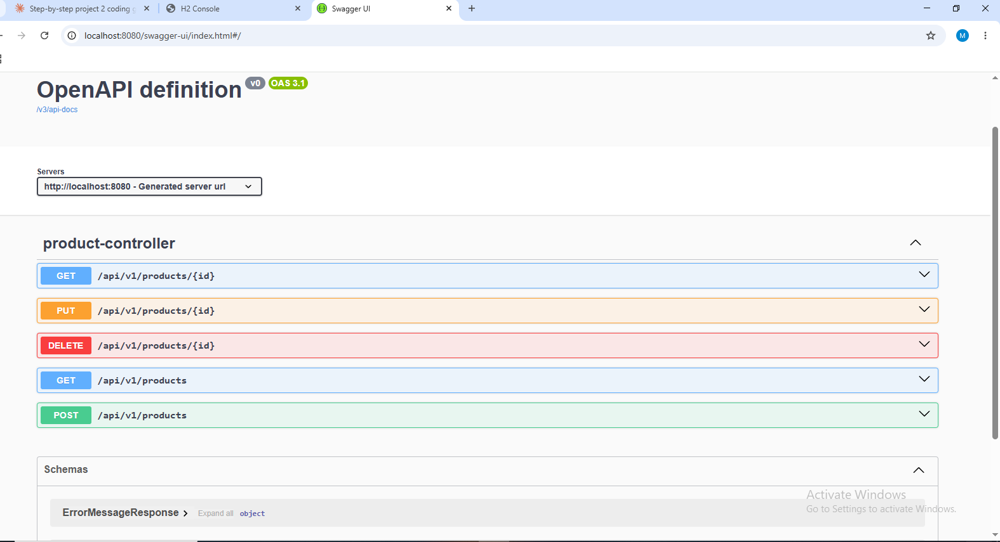
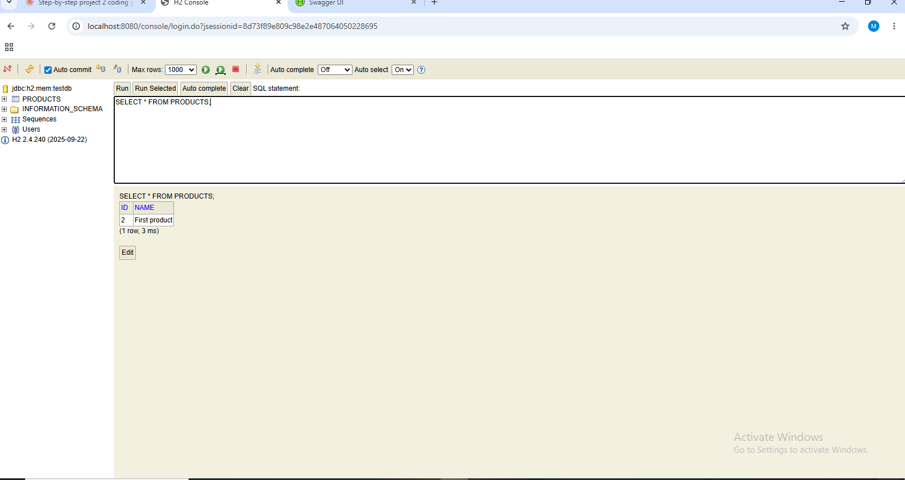
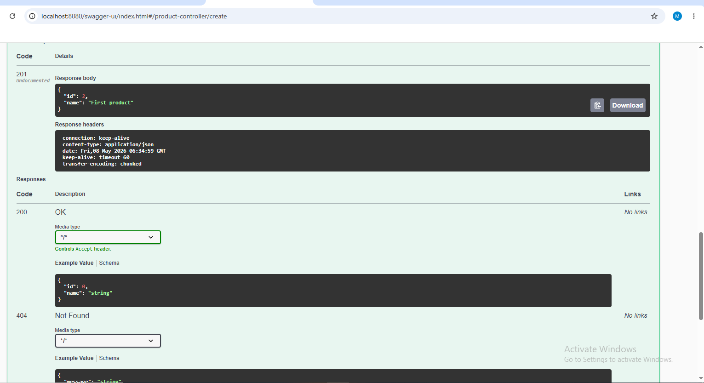
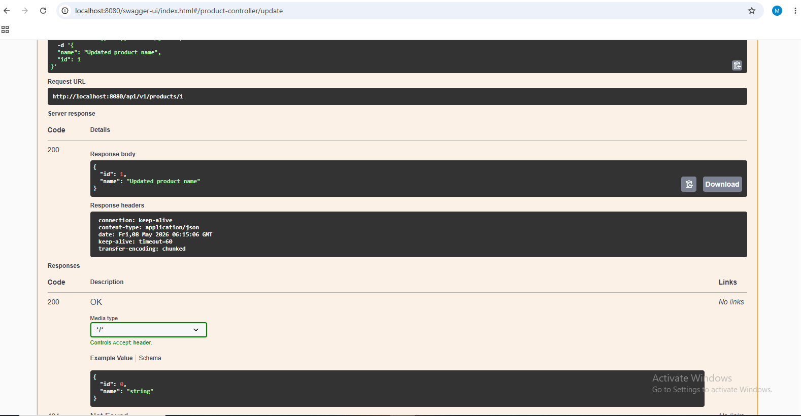
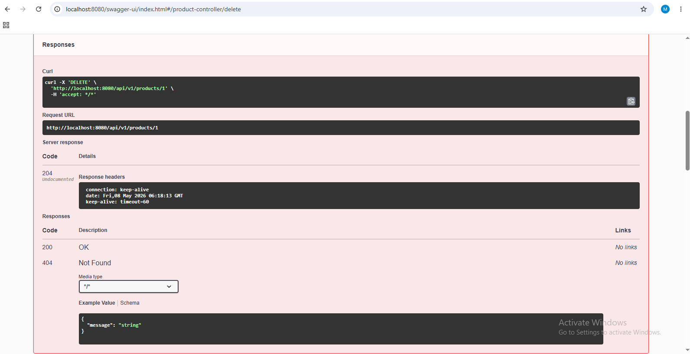
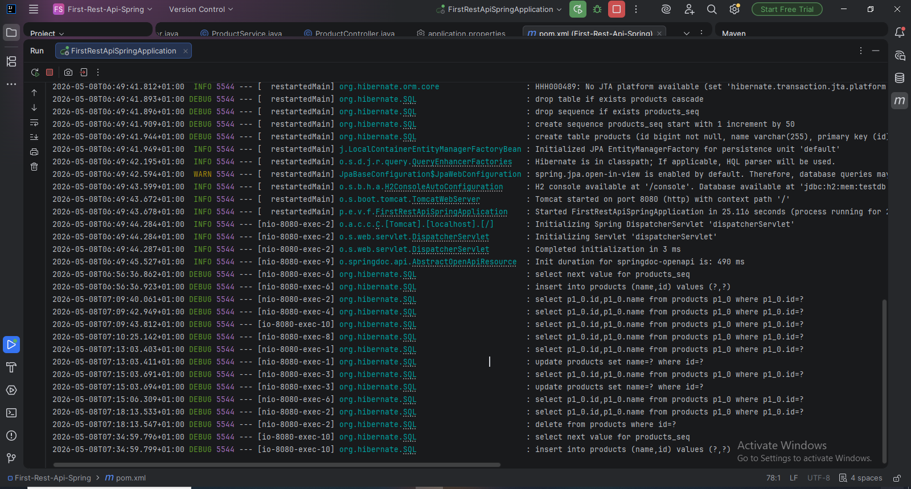

# First REST API - Spring Boot

A REST API application built with Spring Boot for Vistula University.

## Technologies Used
- Java
- Spring Boot
- Spring Data JPA
- H2 Database (in-memory)
- Swagger UI (OpenAPI)
- Maven

## How to Run the Application

1. Clone the repository
2. Open the project in IntelliJ IDEA
3. Wait for Maven to download dependencies
4. Run `FirstRestApiSpringApplication.java`
5. The application starts on `http://localhost:8080`

---

## How to Test - Swagger UI

Open your browser and go to:
http://localhost:8080/swagger-ui/index.html



---

## How to Test - H2 Database Console

Open your browser and go to:
http://localhost:8080/console

Login details:
- JDBC URL: jdbc:h2:mem:testdb
- User Name: sa
- Password: (leave empty)



---

## API Endpoints

### 1. Create a Product (POST)
- **URL:** `http://localhost:8080/api/v1/products`
- **Method:** POST
- **Request body:**
```json
{
  "name": "First product"
}
```
- **Response (201 Created):**
```json
{
  "id": 1,
  "name": "First product"
}
```


---

### 2. Get All Products (GET)
- **URL:** `http://localhost:8080/api/v1/products`
- **Method:** GET
- **Response (200 OK):**
```json
[
  {
    "id": 1,
    "name": "First product"
  }
]
```

---

### 3. Get Product by ID (GET)
- **URL:** `http://localhost:8080/api/v1/products/1`
- **Method:** GET
- **Response (200 OK):**
```json
{
  "id": 1,
  "name": "First product"
}
```

---

### 4. Update a Product (PUT)
- **URL:** `http://localhost:8080/api/v1/products/1`
- **Method:** PUT
- **Request body:**
```json
{
  "name": "Updated product name",
  "id": 1
}
```
- **Response (200 OK):**
```json
{
  "id": 1,
  "name": "Updated product name"
}
```


---

### 5. Delete a Product (DELETE)
- **URL:** `http://localhost:8080/api/v1/products/1`
- **Method:** DELETE
- **Response:** 204 No Content



---

### 6. Error Handling
If you request a product ID that does not exist:
- **Response (404 Not Found):**
```json
{
  "message": "Product with 99 not found"
}
```

---

## SQL Queries in IntelliJ Console
All database queries are logged automatically:



---

## Project Structure